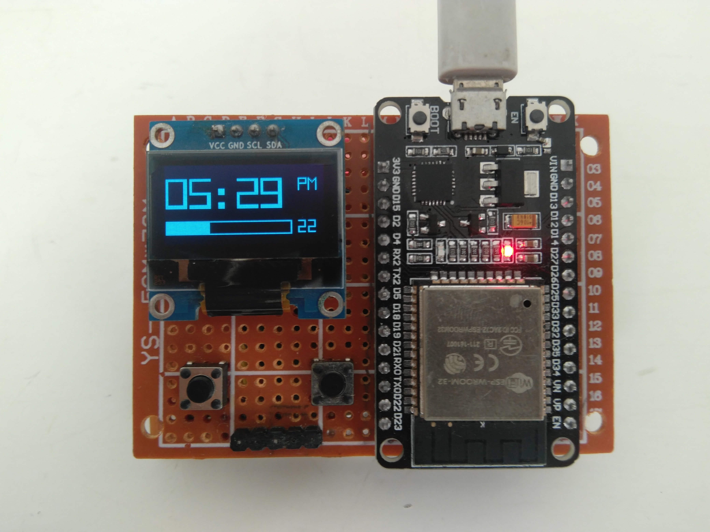

# E-clocked32 
My attempt at creating a gui interface with esp. 
fearures  
- set time
- set alarm
- beautiful front face 
- day and date display (word clock style)

implemented using u8g2 library. 

